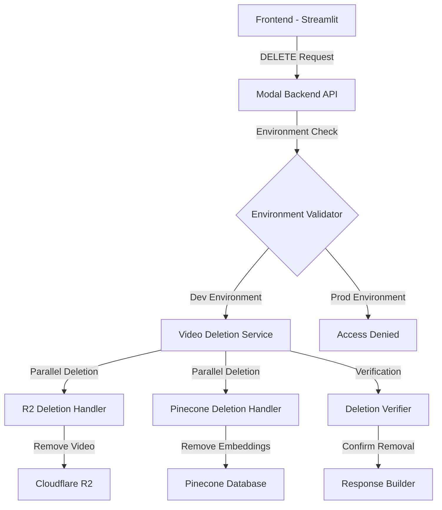

# Design Document: Video Deletion System

## Overview

The Video Deletion System provides secure, comprehensive removal of video content from the ClipABit platform. The system operates across two primary storage layers (Cloudflare R2 and Pinecone vector database) while enforcing environment-based access controls to protect production data.

The design emphasizes data consistency, comprehensive error handling, and atomic operations where possible. The system integrates with the existing Modal-based backend architecture and Streamlit frontend, maintaining consistency with current patterns and practices.

## Architecture

### System Components



### Data Flow

1. **Request Initiation**: Frontend sends DELETE request with hashed_identifier
2. **Environment Validation**: System checks ENVIRONMENT variable for dev/prod status
3. **Identifier Validation**: Decode and validate hashed_identifier format
4. **Parallel Deletion**: Simultaneously remove data from R2 and Pinecone
5. **Verification**: Confirm successful removal from both systems
6. **Response Generation**: Return structured response with operation results

## Components and Interfaces

### 1. Video Deletion Service (Core Orchestrator)

**Purpose**: Central coordinator for deletion operations across storage systems.

**Interface**:
```python
class VideoDeletionService:
    def __init__(self, r2_connector: R2Connector, pinecone_connector: PineconeConnector, environment: str)
    
    async def delete_video(self, hashed_identifier: str, namespace: str = "web-demo") -> DeletionResult
    def _validate_environment(self) -> bool
    def _decode_identifier(self, hashed_identifier: str) -> Tuple[str, str, str]
    async def _delete_from_r2(self, bucket: str, key: str) -> R2DeletionResult
    async def _delete_from_pinecone(self, video_metadata: dict, namespace: str) -> PineconeDeletionResult
    async def _verify_deletion(self, hashed_identifier: str, namespace: str) -> VerificationResult
```

**Responsibilities**:
- Environment-based access control
- Identifier validation and decoding
- Orchestrating parallel deletion operations
- Aggregating results from storage systems
- Verification of successful deletion

### 2. R2 Deletion Handler

**Purpose**: Manages video file removal from Cloudflare R2 storage.

**Interface**:
```python
class R2DeletionHandler:
    def __init__(self, r2_connector: R2Connector)
    
    async def delete_video_file(self, hashed_identifier: str) -> R2DeletionResult
    def _extract_r2_key(self, hashed_identifier: str) -> str
    async def _verify_r2_deletion(self, bucket: str, key: str) -> bool
```

**Integration**: Extends existing `R2Connector` class with deletion capabilities.

### 3. Pinecone Deletion Handler

**Purpose**: Manages chunk embedding removal from Pinecone vector database.

**Interface**:
```python
class PineconeDeletionHandler:
    def __init__(self, pinecone_connector: PineconeConnector)
    
    async def delete_video_chunks(self, hashed_identifier: str, namespace: str) -> PineconeDeletionResult
    async def _find_video_chunks(self, hashed_identifier: str, namespace: str) -> List[str]
    async def _batch_delete_chunks(self, chunk_ids: List[str], namespace: str) -> bool
    async def _verify_pinecone_deletion(self, chunk_ids: List[str], namespace: str) -> bool
```

**Integration**: Extends existing `PineconeConnector` class with deletion and batch operations.

### 4. Environment Validator

**Purpose**: Enforces environment-based access control for deletion operations.

**Interface**:
```python
class EnvironmentValidator:
    def __init__(self, environment: str)
    
    def validate_deletion_access(self) -> ValidationResult
    def is_dev_environment(self) -> bool
    def get_access_error_message(self) -> str
```

### 5. API Endpoint Handler

**Purpose**: FastAPI endpoint for handling deletion requests.

**Interface**:
```python
@app.method()
async def delete_video(self, hashed_identifier: str, namespace: str = "web-demo") -> dict
```

**HTTP Specification**:
- **Method**: DELETE
- **Path**: `/videos/{hashed_identifier}`
- **Query Parameters**: `namespace` (optional, default: "web-demo")
- **Response Codes**: 200 (success), 403 (forbidden), 404 (not found), 500 (error)

## Data Models

### DeletionResult

```python
@dataclass
class DeletionResult:
    success: bool
    hashed_identifier: str
    namespace: str
    r2_result: R2DeletionResult
    pinecone_result: PineconeDeletionResult
    verification_result: VerificationResult
    error_message: Optional[str] = None
    timestamp: datetime = field(default_factory=datetime.utcnow)
```

### R2DeletionResult

```python
@dataclass
class R2DeletionResult:
    success: bool
    bucket: str
    key: str
    file_existed: bool
    error_message: Optional[str] = None
    bytes_deleted: Optional[int] = None
```

### PineconeDeletionResult

```python
@dataclass
class PineconeDeletionResult:
    success: bool
    chunks_found: int
    chunks_deleted: int
    chunk_ids: List[str]
    namespace: str
    error_message: Optional[str] = None
```

### VerificationResult

```python
@dataclass
class VerificationResult:
    r2_verified: bool
    pinecone_verified: bool
    verification_errors: List[str]
    timestamp: datetime = field(default_factory=datetime.utcnow)
```

### Frontend Integration Models

```python
@dataclass
class VideoDisplayItem:
    hashed_identifier: str
    filename: str
    presigned_url: str
    show_delete_button: bool  # Based on environment
    
@dataclass
class DeletionConfirmation:
    video_filename: str
    confirmation_required: bool = True
    warning_message: str = "This action cannot be undone"
```


## Correctness Properties

*A property is a characteristic or behavior that should hold true across all valid executions of a system—essentially, a formal statement about what the system should do. Properties serve as the bridge between human-readable specifications and machine-verifiable correctness guarantees.*

Before defining the correctness properties, let me analyze each acceptance criterion for testability:

### Acceptance Criteria Testing Prework

**1.1** WHEN a valid hashed_identifier is provided, THE Video_Deletion_System SHALL remove the video file from R2_Storage
- Thoughts: This is a rule that should apply to all valid hashed identifiers. We can generate random valid identifiers, create corresponding videos in R2, then delete them and verify they're gone.
- Testable: yes - property

**1.2** WHEN a valid hashed_identifier is provided, THE Video_Deletion_System SHALL remove all associated chunk embeddings from Pinecone_Database
- Thoughts: This should hold for any video with any number of chunks. We can create videos with varying numbers of chunks, delete them, and verify all chunks are removed.
- Testable: yes - property

**1.3** WHEN deletion is requested, THE Video_Deletion_System SHALL delete data from both storage systems atomically or provide clear rollback information
- Thoughts: This is about system behavior across all deletion requests. We can test that either both succeed or we get proper error information.
- Testable: yes - property

**1.4** WHEN deletion completes successfully, THE Video_Deletion_System SHALL return confirmation of successful removal from both systems
- Thoughts: For any successful deletion, the response should contain confirmation from both systems. We can verify the response structure.
- Testable: yes - property

**1.5** WHEN a hashed_identifier maps to multiple chunks in Pinecone, THE Video_Deletion_System SHALL remove all associated chunks
- Thoughts: This is specifically about videos with multiple chunks. This is covered by 1.2 but focuses on the multi-chunk case.
- Testable: yes - property (covered by 1.2)

**2.1** WHEN a hashed_identifier does not exist in R2_Storage, THE Video_Deletion_System SHALL continue with Pinecone cleanup and report the missing R2 data
- Thoughts: This tests error handling for missing R2 data. We can create scenarios where R2 data is missing but Pinecone data exists.
- Testable: yes - property

**2.2** WHEN a hashed_identifier has no associated chunks in Pinecone_Database, THE Video_Deletion_System SHALL continue with R2 cleanup and report the missing Pinecone data
- Thoughts: This tests error handling for missing Pinecone data. We can create scenarios where Pinecone data is missing but R2 data exists.
- Testable: yes - property

**2.3** WHEN R2_Storage deletion fails due to network issues, THE Video_Deletion_System SHALL return a detailed error message and not attempt Pinecone deletion
- Thoughts: This is about error handling behavior. We can mock network failures and verify the system responds correctly.
- Testable: yes - property

**2.4** WHEN Pinecone_Database deletion fails, THE Video_Deletion_System SHALL return a detailed error message indicating partial completion
- Thoughts: This tests partial failure scenarios. We can mock Pinecone failures and verify proper error reporting.
- Testable: yes - property

**2.5** WHEN both storage systems report the video does not exist, THE Video_Deletion_System SHALL return a "not found" status without error
- Thoughts: This is a specific edge case for non-existent videos. This is an important edge case to test.
- Testable: yes - example

**3.1** WHEN the system is running in Dev_Environment, THE Video_Deletion_System SHALL allow deletion operations
- Thoughts: This should hold for all deletion requests in dev environment. We can test with various identifiers.
- Testable: yes - property

**3.2** WHEN the system is running in Prod_Environment, THE Video_Deletion_System SHALL reject deletion requests with an authorization error
- Thoughts: This should hold for all deletion attempts in prod. We can test that all requests are rejected.
- Testable: yes - property

**3.3** WHEN environment validation occurs, THE Video_Deletion_System SHALL check the ENVIRONMENT variable to determine access permissions
- Thoughts: This is about the implementation mechanism, not a functional requirement we can test externally.
- Testable: no

**3.4** WHEN an unauthorized deletion is attempted in production, THE Video_Deletion_System SHALL log the attempt for security monitoring
- Thoughts: This is about logging behavior. We can verify logs are created for unauthorized attempts.
- Testable: yes - property

**4.1** THE Video_Deletion_System SHALL provide a DELETE endpoint at `/videos/{hashed_identifier}`
- Thoughts: This is about the API structure existing. This is a specific example to verify.
- Testable: yes - example

**4.2** WHEN the endpoint receives a valid request, THE Video_Deletion_System SHALL validate the hashed_identifier format
- Thoughts: For any request, validation should occur. We can test with various valid and invalid formats.
- Testable: yes - property

**4.3** WHEN the endpoint processes a request, THE Video_Deletion_System SHALL include namespace parameter support for data partitioning
- Thoughts: This is about API functionality. We can test that namespace parameter is respected.
- Testable: yes - property

**4.4** WHEN the endpoint completes processing, THE Video_Deletion_System SHALL return appropriate HTTP status codes
- Thoughts: For any request outcome, the correct status code should be returned. We can test various scenarios.
- Testable: yes - property

**4.5** WHEN the endpoint encounters errors, THE Video_Deletion_System SHALL return structured JSON error responses with detailed messages
- Thoughts: For any error condition, the response should be properly structured. We can test error scenarios.
- Testable: yes - property

**5.1** WHEN viewing videos in the search demo, THE Video_Deletion_System SHALL display a trash can icon for each video
- Thoughts: This is about UI rendering. We can verify the UI contains delete buttons.
- Testable: yes - example

**5.2** WHEN the trash can icon is clicked, THE Video_Deletion_System SHALL show a confirmation dialog before proceeding
- Thoughts: This is UI interaction behavior. We can test that confirmation is required.
- Testable: yes - example

**5.3** WHEN deletion is confirmed, THE Video_Deletion_System SHALL call the backend deletion endpoint
- Thoughts: This is about the integration between frontend and backend. We can verify API calls are made.
- Testable: yes - example

**5.4** WHEN deletion completes successfully, THE Video_Deletion_System SHALL remove the video from the current display and show a success message
- Thoughts: This is UI behavior after successful deletion. We can verify UI updates correctly.
- Testable: yes - example

**5.5** WHEN deletion fails, THE Video_Deletion_System SHALL display an error message and keep the video in the display
- Thoughts: This is UI error handling. We can verify UI behavior on failure.
- Testable: yes - example

**5.6** WHEN running in Prod_Environment, THE Video_Deletion_System SHALL hide all delete buttons from the interface
- Thoughts: This is environment-based UI rendering. We can verify buttons are hidden in prod.
- Testable: yes - example

**6.1** WHEN processing a hashed_identifier, THE Video_Deletion_System SHALL decode and validate the identifier format
- Thoughts: For any identifier, validation should occur. This is covered by 4.2.
- Testable: yes - property (covered by 4.2)

**6.2** WHEN querying Pinecone for associated chunks, THE Video_Deletion_System SHALL use the correct namespace and video metadata filters
- Thoughts: For any query, the correct filters should be applied. We can verify query parameters.
- Testable: yes - property

**6.3** WHEN multiple chunks exist for a video, THE Video_Deletion_System SHALL ensure all chunks are identified and removed
- Thoughts: This is covered by 1.2 and 1.5.
- Testable: yes - property (covered by 1.2)

**6.4** WHEN deletion operations complete, THE Video_Deletion_System SHALL verify removal by attempting to retrieve the deleted data
- Thoughts: For any deletion, verification should occur. We can test that verification is performed.
- Testable: yes - property

**6.5** WHEN namespace filtering is applied, THE Video_Deletion_System SHALL ensure deletion only affects the specified namespace
- Thoughts: For any namespace, deletion should be isolated. We can test cross-namespace isolation.
- Testable: yes - property

**7.1** WHEN a deletion request is received, THE Video_Deletion_System SHALL log the request with hashed_identifier and namespace
- Thoughts: For any request, logging should occur. We can verify log entries are created.
- Testable: yes - property

**7.2** WHEN deletion operations complete, THE Video_Deletion_System SHALL log the results including items removed from each storage system
- Thoughts: For any completion, results should be logged. We can verify log content.
- Testable: yes - property

**7.3** WHEN errors occur during deletion, THE Video_Deletion_System SHALL log detailed error information for debugging
- Thoughts: For any error, detailed logs should be created. We can verify error logging.
- Testable: yes - property

**7.4** WHEN unauthorized deletion attempts occur, THE Video_Deletion_System SHALL log security events with request details
- Thoughts: This is the same as 3.4.
- Testable: yes - property (covered by 3.4)

**7.5** WHEN deletion verification is performed, THE Video_Deletion_System SHALL log the verification results
- Thoughts: For any verification, results should be logged. We can verify verification logging.
- Testable: yes - property

### Property Reflection

After reviewing all testable properties, I've identified the following consolidations:

- **1.5** is redundant with **1.2** (both test complete chunk removal)
- **6.1** is redundant with **4.2** (both test identifier validation)
- **6.3** is redundant with **1.2** (both test multi-chunk removal)
- **7.4** is redundant with **3.4** (both test unauthorized attempt logging)

The remaining properties provide unique validation value and should be implemented.

### Core Correctness Properties

**Property 1: Complete R2 Deletion**
*For any* valid hashed_identifier with corresponding R2 data, deleting the video should result in the video file no longer existing in R2 storage.
**Validates: Requirements 1.1**

**Property 2: Complete Pinecone Deletion**
*For any* valid hashed_identifier with associated chunk embeddings, deleting the video should result in all chunk embeddings being removed from Pinecone.
**Validates: Requirements 1.2, 1.5, 6.3**

**Property 3: Dual System Confirmation**
*For any* successful deletion operation, the response should contain confirmation of removal from both R2 and Pinecone storage systems.
**Validates: Requirements 1.4**

**Property 4: Graceful R2 Missing Data Handling**
*For any* hashed_identifier with Pinecone data but no R2 data, deletion should complete Pinecone cleanup and report the missing R2 data without failing.
**Validates: Requirements 2.1**

**Property 5: Graceful Pinecone Missing Data Handling**
*For any* hashed_identifier with R2 data but no Pinecone data, deletion should complete R2 cleanup and report the missing Pinecone data without failing.
**Validates: Requirements 2.2**

**Property 6: R2 Failure Isolation**
*For any* deletion request where R2 deletion fails, the system should return a detailed error message and not proceed with Pinecone deletion.
**Validates: Requirements 2.3**

**Property 7: Pinecone Failure Reporting**
*For any* deletion request where Pinecone deletion fails after R2 succeeds, the system should return a detailed error indicating partial completion.
**Validates: Requirements 2.4**

**Property 8: Dev Environment Access**
*For any* deletion request in dev environment, the system should allow the operation to proceed.
**Validates: Requirements 3.1**

**Property 9: Prod Environment Restriction**
*For any* deletion request in prod environment, the system should reject the request with a 403 Forbidden status.
**Validates: Requirements 3.2**

**Property 10: Unauthorized Attempt Logging**
*For any* deletion attempt in prod environment, the system should create a security log entry with request details.
**Validates: Requirements 3.4, 7.4**

**Property 11: Identifier Validation**
*For any* deletion request, the system should validate the hashed_identifier format before attempting deletion operations.
**Validates: Requirements 4.2, 6.1**

**Property 12: Namespace Isolation**
*For any* deletion request with a specified namespace, the system should only delete data within that namespace and not affect other namespaces.
**Validates: Requirements 4.3, 6.2, 6.5**

**Property 13: HTTP Status Code Correctness**
*For any* deletion request outcome (success, not found, forbidden, error), the system should return the appropriate HTTP status code (200, 404, 403, 500).
**Validates: Requirements 4.4**

**Property 14: Structured Error Responses**
*For any* error condition during deletion, the system should return a JSON response with structured error information including error type and detailed message.
**Validates: Requirements 4.5**

**Property 15: Deletion Verification**
*For any* deletion operation that reports success, verification by attempting to retrieve the data should confirm the data no longer exists.
**Validates: Requirements 6.4**

**Property 16: Request Logging**
*For any* deletion request received, the system should create a log entry containing the hashed_identifier and namespace.
**Validates: Requirements 7.1**

**Property 17: Result Logging**
*For any* completed deletion operation, the system should log the results including the number of items removed from each storage system.
**Validates: Requirements 7.2**

**Property 18: Error Logging**
*For any* error during deletion, the system should log detailed error information including error type, message, and stack trace.
**Validates: Requirements 7.3**

**Property 19: Verification Logging**
*For any* deletion verification performed, the system should log the verification results including success/failure status.
**Validates: Requirements 7.5**

## Error Handling

### Error Categories

1. **Validation Errors**
   - Invalid hashed_identifier format
   - Missing required parameters
   - Malformed namespace values

2. **Authorization Errors**
   - Production environment deletion attempts
   - Missing authentication credentials (future)

3. **Storage Errors**
   - R2 connection failures
   - Pinecone connection failures
   - Network timeouts

4. **Data Consistency Errors**
   - Partial deletion failures
   - Verification failures
   - Orphaned data detection

### Error Handling Strategy

**Validation Errors**: Return 400 Bad Request with detailed validation messages

**Authorization Errors**: Return 403 Forbidden with security logging

**Storage Errors**: 
- R2 failures: Return 500 Internal Server Error, do not proceed with Pinecone deletion
- Pinecone failures: Return 500 Internal Server Error with partial completion details

**Data Consistency Errors**: Return 500 Internal Server Error with detailed state information for manual intervention

### Error Response Format

```json
{
  "success": false,
  "error": {
    "type": "ValidationError|AuthorizationError|StorageError|ConsistencyError",
    "message": "Human-readable error description",
    "details": {
      "hashed_identifier": "...",
      "namespace": "...",
      "r2_status": "success|failed|not_attempted",
      "pinecone_status": "success|failed|not_attempted",
      "specific_error": "Detailed technical error message"
    }
  },
  "timestamp": "2024-01-01T00:00:00Z"
}
```

## Testing Strategy

### Dual Testing Approach

The testing strategy employs both unit tests and property-based tests to ensure comprehensive coverage:

**Unit Tests**: Focus on specific examples, edge cases, and integration points
- Specific deletion scenarios (single chunk, multiple chunks)
- Error conditions (network failures, missing data)
- Environment validation logic
- API endpoint integration
- Frontend UI interactions

**Property-Based Tests**: Verify universal properties across all inputs
- Use Hypothesis library for Python property-based testing
- Generate random valid/invalid hashed_identifiers
- Test with varying numbers of chunks (0 to 100)
- Test across different namespaces
- Minimum 100 iterations per property test

### Property Test Configuration

Each property-based test will:
- Run minimum 100 iterations to ensure comprehensive input coverage
- Use Hypothesis strategies for generating test data
- Tag tests with comments referencing design properties
- Tag format: `# Feature: video-deletion, Property {number}: {property_text}`

### Test Organization

```
backend/tests/
├── unit/
│   ├── test_video_deletion_service.py
│   ├── test_r2_deletion_handler.py
│   ├── test_pinecone_deletion_handler.py
│   └── test_environment_validator.py
├── integration/
│   ├── test_deletion_endpoint.py
│   └── test_deletion_verification.py
└── property/
    ├── test_deletion_properties.py
    └── test_error_handling_properties.py

frontend/streamlit/tests/
├── test_delete_button_rendering.py
└── test_deletion_confirmation.py
```

### Key Test Scenarios

1. **Happy Path**: Delete video with data in both R2 and Pinecone
2. **Partial Data**: Delete video with data in only one storage system
3. **Non-existent Video**: Attempt to delete video that doesn't exist
4. **Environment Restrictions**: Verify prod environment blocks deletion
5. **Multi-chunk Videos**: Delete videos with varying numbers of chunks
6. **Namespace Isolation**: Verify deletion doesn't affect other namespaces
7. **Concurrent Deletions**: Test parallel deletion requests
8. **Network Failures**: Simulate storage system failures
9. **Verification Failures**: Test scenarios where verification detects issues

### Mock and Fixture Strategy

- Mock external services (R2, Pinecone) for unit tests
- Use test fixtures for integration tests with actual storage
- Create test namespaces for isolation
- Clean up test data after each test run
- Use pytest fixtures for common setup/teardown

## Implementation Notes

### Integration with Existing Code

1. **R2Connector Extension**: Add `delete_video_file()` method to existing class
2. **PineconeConnector Extension**: Add `delete_by_metadata()` and `batch_delete()` methods
3. **Modal Endpoint**: Add new `@modal.method()` decorated function in `main.py`
4. **Frontend Config**: Add deletion API URL to `Config` class
5. **Streamlit UI**: Modify `search_demo.py` to add delete buttons

### Performance Considerations

- Parallel deletion from R2 and Pinecone using asyncio
- Batch deletion for Pinecone chunks (up to 1000 IDs per batch)
- Connection pooling for storage clients
- Timeout configuration (30s for R2, 60s for Pinecone)

### Security Considerations

- Environment validation before any deletion operations
- Audit logging for all deletion attempts
- Rate limiting on deletion endpoint (future enhancement)
- Namespace validation to prevent cross-namespace deletion

### Deployment Considerations

- No database migrations required
- No new Modal secrets needed
- Frontend environment variable already exists
- Backward compatible with existing API endpoints