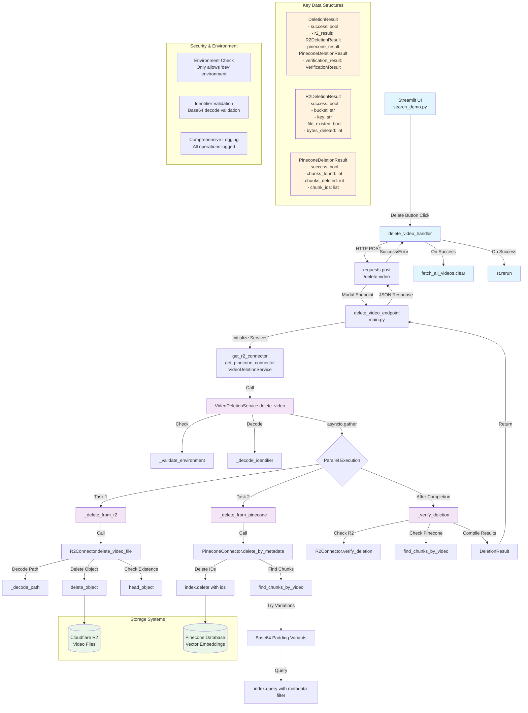

# Video Deletion System Architecture

## Key Functions Breakdown

### Frontend (Streamlit)
- **`delete_video_handler`**: Main UI deletion handler with confirmation dialog
- **`fetch_all_videos.clear()`**: Cache invalidation for immediate UI updates
- **`st.rerun()`**: Force UI refresh after deletion

### Backend API (Modal)
- **`delete_video_endpoint`**: HTTP endpoint that orchestrates the deletion
- **Service initialization functions**: Setup R2 and Pinecone connectors

### Core Deletion Service
- **`VideoDeletionService.delete_video`**: Main orchestrator function
- **`_validate_environment`**: Security check (dev-only deletion)
- **`_decode_identifier`**: Base64 identifier parsing
- **`_delete_from_r2`** & **`_delete_from_pinecone`**: Parallel deletion operations
- **`_verify_deletion`**: Post-deletion verification

### R2 Connector
- **`delete_video_file`**: Main R2 deletion method
- **`_decode_path`**: Base64 to bucket/key conversion
- **`delete_object`**: Actual S3-compatible deletion
- **`verify_deletion`**: Confirm file no longer exists

### Pinecone Connector
- **`delete_by_metadata`**: Main Pinecone deletion method
- **`find_chunks_by_video`**: Find chunks with base64 padding handling
- **`index.query`**: Vector database query with metadata filters
- **`index.delete`**: Bulk deletion of vector chunks

## Async Flow
The system uses `asyncio.gather()` to run R2 and Pinecone deletions in parallel, significantly improving performance. The async pattern allows both storage systems to be updated simultaneously rather than sequentially.

## Error Handling & Security
- Environment-based access control (dev-only)
- Comprehensive logging at each step
- Graceful error handling with detailed error messages
- Verification phase to ensure deletion success
- Base64 padding variation handling for identifier matching